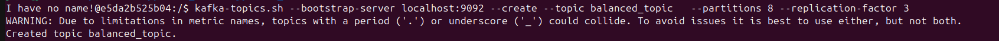
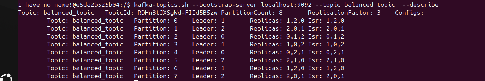
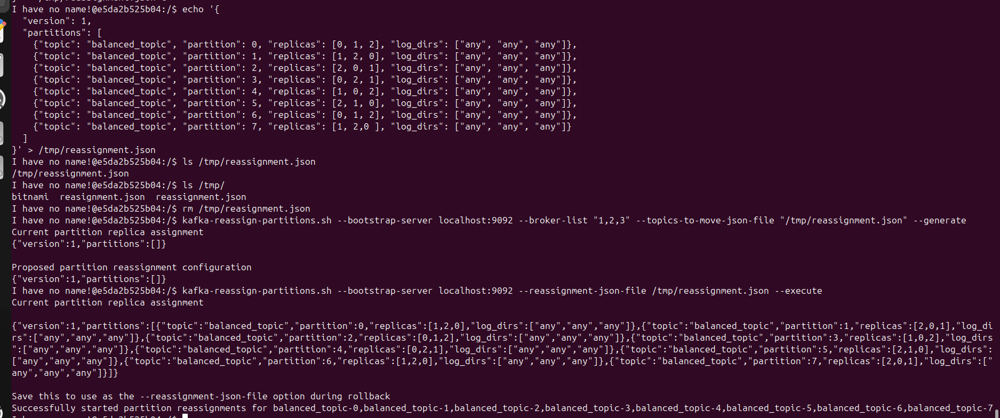
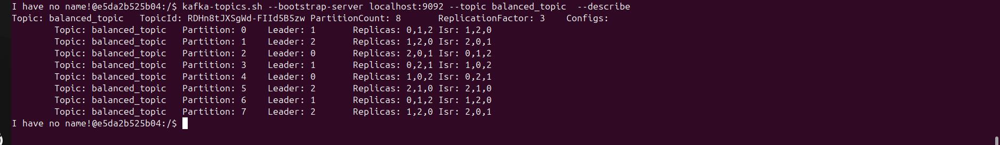
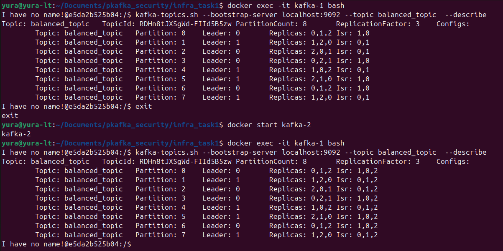

# pkafka_security
Проектная работа четвертого модуля
## Задание 1. Балансировка партиций и диагностика кластера
<details close>
<summary>задание:</summary>
1. Создайте новый топик balanced_topic с 8 партициями и фактором репликации 3.
2. Определите текущее распределение партиций.
3. Создайте JSON-файл reassignment.json для перераспределения партиций.
4. Перераспределите партиции.
5. Проверьте статус перераспределения.
6. Убедитесь, что конфигурация изменилась.
7. Смоделируйте сбой брокера:
    a.  Остановите брокер kafka-1.
    b.  Проверьте состояние топиков после сбоя.
    c.  Запустите брокер заново.
    d.  Проверьте, восстановилась ли синхронизация реплик.
</details>

1. Перейти в директорию `infra_task1` и выполнить `docker compose up -d`
2. Создание топика:
   - зайти в контейнер, выполнив `docker exec -it kafka-1 bash`
   - выполнить команду `kafka-topics.sh --bootstrap-server localhost:9092 --create --topic balanced_topic   --partitions 8 --replication-factor 3`, будет создан топик с 8 партициями и 3 репликами
     
3. получение текущего распределения партиций: выполнить `kafka-topics.sh --bootstrap-server localhost:9092 --topic balanced_topic  --describe`
     

4. создание файла переопределения партиций - `reassignment.json` и выполнить:
    ```
    echo '{
    "version": 1,
    "partitions": [
        {"topic": "balanced_topic", "partition": 0, "replicas": [0, 1, 2], "log_dirs": ["any", "any", "any"]},
        {"topic": "balanced_topic", "partition": 1, "replicas": [1, 2, 0], "log_dirs": ["any", "any", "any"]},
        {"topic": "balanced_topic", "partition": 2, "replicas": [2, 0, 1], "log_dirs": ["any", "any", "any"]},
        {"topic": "balanced_topic", "partition": 3, "replicas": [0, 2, 1], "log_dirs": ["any", "any", "any"]},
        {"topic": "balanced_topic", "partition": 4, "replicas": [1, 0, 2], "log_dirs": ["any", "any", "any"]},
        {"topic": "balanced_topic", "partition": 5, "replicas": [2, 1, 0], "log_dirs": ["any", "any", "any"]},
        {"topic": "balanced_topic", "partition": 6, "replicas": [0, 1, 2], "log_dirs": ["any", "any", "any"]},
        {"topic": "balanced_topic", "partition": 7, "replicas": [1, 2,0 ], "log_dirs": ["any", "any", "any"]}
    ]
    }' > /tmp/reassignment.json
    ```
5. перераспределение партиций:
   - `kafka-reassign-partitions.sh --bootstrap-server localhost:9092 --broker-list "1,2,3" --topics-to-move-json-file "/tmp/reassignment.json" --generate`
   - `kafka-reassign-partitions.sh --bootstrap-server localhost:9092 --reassignment-json-file /tmp/reassignment.json --execute`
     
6. проверка, что конфигураци изменилась:
    `kafka-topics.sh --bootstrap-server localhost:9092 --topic balanced_topic  --describe`
    получили
    
7. моделирование сбоя брокера:
   - отстановка одного из броекров (контейнера) `docker stop kafka-2`
   - проверка перераспределения:  `kafka-topics.sh --bootstrap-server localhost:9092 --topic balanced_topic  --describe`
   - запуск брокера (контейнера): `docker start kafka-2`
   - проверка, что брокер учавствует в перераспределении (репликации):  `kafka-topics.sh --bootstrap-server localhost:9092 --topic balanced_topic  --describe`
   этапы показаны на скрине ниже 
   

Помогает лучше сбалансировать нагрузку

Задание 2. Настройка защищённого соединения и управление доступом
<describe close>
<summary>задание</summary>
1. Создайте сертификаты для каждого брокера.
2. Создайте Truststore и Keystore для каждого брокера.
3. Настройте дополнительные брокеры в режиме SSL. Ранее в курсе вы уже работали с кластером Kafka, состоящим из трёх брокеров. Используйте имеющийся docker-compose кластера и настройте для него SSL.
4. Создать два топика:
    - topic-1
    - topic-2
5. Настроить права доступа:
    - topic-1: Доступен как для продюсеров, так и для консьюмеров.
    - topic-2: Продюсеры могут отправлять сообщения. Консьюмеры не имеют доступа к чтению данных.
</describe>


### Запуск
1. добавить в `/etc/hosts`:
   ```
   192.168.0.2 kb1.loc
    192.168.0.3 kb2.loc
    192.168.0.4 kb3.loc
   ```
2. перейти в директорию `infra_task2` и выполнить `docker compose up`
   1. в котнтейнеры разложатся конфиги и серты
   2. запустится kafka
   3. создадуться топики topic-1 topic-2
   4. накинуться права на топики, группы потребителей и пользователя user
3. петрейти в корневой каталог
4. установить зависимости
5. запустить приложение `go run cmd/main.go`
   1. консьюмер подключится
   2. каждую секунду продюсер будет слать сообщения в топик, а консьюмер будет их читать
   3. если попробовать консьюмеро подключиться к topic-2, то у него не хватит прав